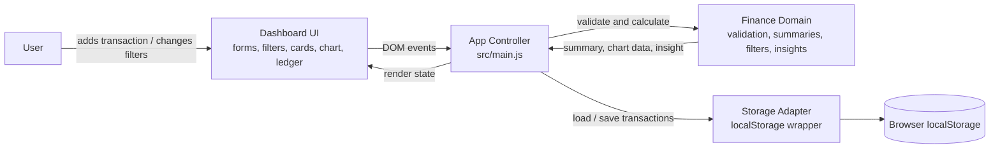
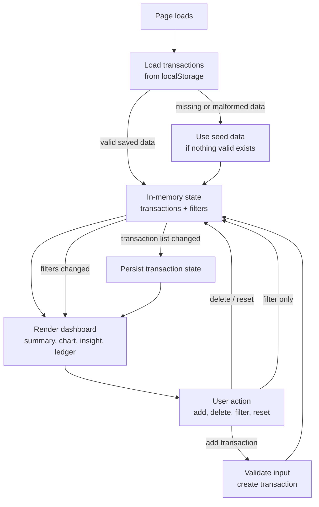
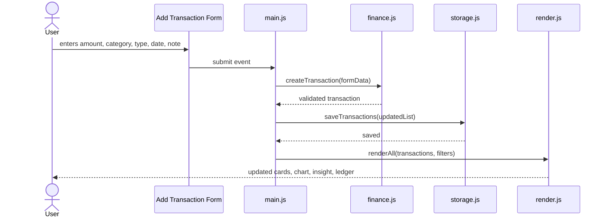

# Ledgerline

Ledgerline is a small personal finance dashboard built for the mini fintech take-home assignment. The goal was not to build a huge product, but to make the core workflow feel complete: record money in or out, understand the current balance, and notice where spending is concentrating.

The app is intentionally local-first. It runs in the browser, stores transactions in `localStorage`, and does not require an account, backend, database, or API key.

## What It Does

- Adds transactions with amount, category, type, date, and an optional note.
- Lists all transactions in a clean ledger view.
- Filters the ledger by category, start date, and end date.
- Calculates total income, total expense, net balance, and top spending category.
- Shows a spending-by-category bar chart.
- Surfaces a rule-based insight from the current data.
- Includes demo data so the dashboard has meaningful behavior on first load.

## Product Thinking

For this assignment I treated the dashboard like a compact internal finance tool rather than a marketing page. The first screen is the product itself: summary, transaction entry, chart, insight, and ledger. There is no hero-only landing experience because the main value of the assignment is in the working dashboard.

The interface is designed to feel calm and operational. Finance tools need to be easy to scan, especially when users are comparing categories, totals, and individual rows. I kept the layout dense enough to be useful, but avoided making it feel like a spreadsheet clone.

The visual direction uses a dark navigation rail, warm paper background, sharp bordered panels, and a few high-contrast accent colors. The intent is to look designed without making the UI noisy.

## Architecture

The project is a small static SPA using plain HTML, CSS, and ES modules.

### System Design

At a high level, Ledgerline is split into four simple parts: browser UI, app controller, domain logic, and local persistence. The browser is the only runtime, so there is no network dependency in the current version.



The important decision here is that the UI does not calculate finance values directly. It asks the domain layer for derived values, then renders the result. That keeps the business rules easier to test and prevents the dashboard from becoming a set of disconnected DOM updates.

### Data Flow

The app follows a small unidirectional flow. User actions update state, state is persisted when needed, and the screen is re-rendered from the latest state.



Filtering is intentionally kept client-side because the dataset is small and local. If this were backed by an API later, the same flow could still work, but the storage adapter would become a repository that talks to the server.

### Transaction Lifecycle



This keeps the add-transaction path explicit. Validation happens before persistence, persistence happens before the next render, and the UI always reflects the current transaction list.

```text
.
|-- index.html
|-- scripts/
|   `-- dev-server.mjs
|-- src/
|   |-- data/
|   |   |-- seed.js
|   |   `-- storage.js
|   |-- domain/
|   |   |-- finance.js
|   |   `-- finance.test.js
|   |-- ui/
|   |   `-- render.js
|   |-- main.js
|   `-- styles.css
|-- package.json
`-- vercel.json
```

### Domain Layer

`src/domain/finance.js` contains the finance logic:

- transaction validation
- transaction sorting and filtering
- summary calculations
- spending-by-category chart data
- rule-based insight generation
- currency and date formatting

Keeping this logic outside the DOM layer makes it easier to test and change. For example, a future React or backend version could reuse the same summary and insight rules with minimal changes.

### Data Layer

`src/data/storage.js` is the persistence boundary. It wraps `localStorage`, validates the saved shape before trusting it, and falls back to seed data if the stored payload is missing or malformed.

That keeps storage concerns out of the UI. The rest of the app only has to ask for transactions or save transactions.

### UI Layer

`src/ui/render.js` owns the rendering functions for:

- summary cards
- chart rows
- insight copy
- transaction table
- category dropdowns

User-provided text is escaped before being inserted into ledger rows. Even in a small local app, I prefer handling this carefully because notes are free-text input.

### App Controller

`src/main.js` wires the app together. It owns:

- in-memory state
- form submission
- filter changes
- delete actions
- demo/reset actions
- persistence after state changes

The file is intentionally straightforward. There is no custom framework hidden inside it; the data flow is meant to be easy to read during review.

## Design Decisions

### Why no frontend framework?

The assignment requirements are small and well-defined. A framework would be reasonable, but not necessary. I chose plain ES modules because it keeps the submission lightweight, fast to review, and easy to deploy.

If this were growing into a multi-page product, I would likely move to React or another component framework once shared state, routing, and component reuse became more meaningful.

### Why local storage?

The prompt does not require authentication or multi-device sync, so `localStorage` is a good fit for a take-home version. It gives the user persistence without introducing backend setup or deployment complexity.

In a production fintech app, this boundary would be replaced by an API-backed repository with authentication, server-side validation, audit logging, and encrypted storage.

### Why a bar chart?

For category spending, a bar chart is easier to compare than a pie chart when there are several categories. It also works better on small screens because labels and values can stay readable.

### Why rule-based insight?

The insight is deliberately explainable. It looks at the current summary and surfaces one of a few simple observations:

- expenses are high relative to income
- one category is dominating spend
- the user has positive cash flow
- there is not enough data yet

This keeps the product honest. The app does not pretend to have AI-powered financial advice; it gives a transparent observation from the data available.

## Testing

The domain logic has focused tests in `src/domain/finance.test.js`.

Current coverage checks:

- summary totals and top category
- category/date filtering
- concentrated-spend insight behavior

Run tests with:

```bash
npm test
```

## Running Locally

```bash
npm install
npm run dev
```

Open:

```text
http://localhost:4173
```

The app has no third-party runtime dependencies. The dev script uses a small Node static server so the ES module imports behave the same way they will after deployment.

## Deployment

The repository includes `vercel.json`, so it can be deployed as a static site on Vercel.

Recommended Vercel settings:

- Framework preset: Other
- Build command: leave empty
- Output directory: leave empty
- Install command: `npm install`

The same app can also be hosted on Netlify, Render, Railway, GitHub Pages, or any static host that serves `index.html`.

## Production Notes

If this became a real finance product, the next changes I would make are:

- replace `localStorage` with an authenticated backend
- add server-side validation and audit trails
- support recurring transactions
- add monthly budgets per category
- add import/export for CSV files
- expand tests around edge cases and accessibility
- introduce end-to-end tests for the full transaction flow

The current version keeps the scope tight, but the code is organized so those changes would not require rewriting the whole app.
